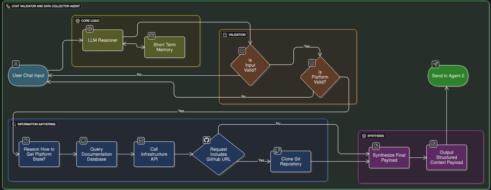

# Agent 1: Chat Validator and Data Collector

> **Comprehensive Documentation for the First Agent in the Automated Provisioning System**

---

## Table of Contents

1. [Agent Architecture & Core Components](#agent-architecture--core-components)
2. [Input Validation Logic](#input-validation-logic)
3. [Data Collection Requirements](#data-collection-requirements)
4. [Agent Workflow: From Chat to Context Payload](#agent-workflow-from-chat-to-context-payload)
5. [Complete Workflow Description](#complete-workflow-description)
6. [Data Contract: The Context Payload](#data-contract-the-context-payload)

---

# Agent Architecture & Core Components

This document details the architecture of the **Chat Validator and Data Collector Agent**. This agent functions as the **Intelligent Gateway** to our entire automated provisioning system. Its design philosophy is to robustly handle ambiguity and transform unstructured user requests into a structured, data-rich payload for downstream processing.

## The Core Engine: Conversational AI Pipeline

### 🧠 Conversational Validation & State Machine

The heart of the agent is its core LLM-driven logic, which functions as a stateful conversational engine. It is responsible for guiding a conversation from ambiguity to a validated, actionable state.

- **Intent Recognition:** It first classifies the user's input to confirm a provisioning intent. Non-provisioning requests are gracefully deflected.
- **Contextual Platform Identification:** It employs a sophisticated, multi-tiered logic to identify the target platform (Proxmox or Kubernetes), moving from explicit keywords to technical artifacts and finally to architectural inference, mimicking the reasoning of a human expert.
- **Entity Extraction and Validation:** The engine actively parses the conversation for required parameters (e.g., VM names, container images). This is not a one-shot process.
- **Short-Term Memory for Dialogue Management:** The agent maintains the context of the conversation. This is crucial for multi-turn interactions, allowing it to ask clarifying questions (e.g., "What port does that container expose?") without losing the original request context.

## The Data Ingestion Toolkit: System & Application Interfaces

### 🛠️ Infrastructure API Clients

Once the platform is identified, the agent utilizes a suite of tools to query the "ground truth" of the infrastructure. These are direct, authenticated API clients, not inferential models.

- **Proxmox API Client:** Fetches the real-time state of the Proxmox cluster, including node status, resource capacity/load, available storage pools, and a manifest of existing templates and ISO images.
- **Kubernetes API Client:** Interacts with the Kubernetes API server to gather data on node status, allocatable resources, namespace-specific constraints (`ResourceQuotas`, `LimitRanges`), and available `StorageClasses`.

## The Output Interface: Structured Data Serialization

### 📄 JSON Formatter & Serializer

This is the final, critical step in the agent's pipeline. It ensures a clean hand-off to the next agent in the system.

- **Function:** Consolidates all validated parameters from the conversation, the state data from the infrastructure APIs.
- **Purpose:** To serialize this aggregated data into a strictly-defined, machine-readable JSON object. This structured format eliminates any ambiguity, allowing the downstream analysis and planning agents to operate on a predictable and reliable data model.

## Workflow Summary: From Chat to JSON

1. **Receive & Validate:** The user sends a natural language request. The **Core Engine** validates the intent and begins a dialogue if necessary.
2. **Identify Platform:** The engine determines the target is either Proxmox or Kubernetes.
3. **Gather Infrastructure State:** The relevant **API Client** is triggered to pull the current state of the target cluster.
4. **Consolidate & Format:** The **JSON Formatter** takes all collected data and serializes it into the final, structured output file.

---

# Input Validation Logic

## Guiding Principle: Conversational Validation

The agent's validation process is designed to be fully conversational. It no longer expects a rigid JSON structure from the user. Instead, the administrator can interact using natural language. The agent's primary validation task is to intelligently parse this language, determine if the request is actionable, and if not, guide the user by asking for the specific missing information.

**The core objective is to successfully extract a complete and valid set of parameters for an `INITIAL_PROVISIONING` request on either Proxmox or Kubernetes.**

## Phase 1: Initial Intent Check

This is the first gate for any user message. The agent's LLM is prompted to check if the user's intent is related to provisioning by looking for keywords like `deploy`, `create`, `install`, `set up`, `provision`, etc. If the intent is not related to provisioning, the agent will respond with a polite, re-directing message.

> **Off-Topic Response Example:**
> "I am an AI assistant designed for resource provisioning on Proxmox and Kubernetes. I can help you deploy applications. Could you please clarify your provisioning request?"

## Phase 2: Platform Identification (Seasoned DevOps Logic)

The agent moves beyond simple keyword matching to infer the target platform with the reasoning of a seasoned DevOps expert. It analyzes the user's request using a clear, three-tiered hierarchy of clues.

### The Decision-Making Hierarchy

#### 1. Explicit Platform Keywords (Highest Priority)

This is the most direct and unambiguous signal. If the user's message contains any of the following terms, the platform decision is considered final.

- **For Proxmox:** `"Proxmox"`, `"VM"`, `"virtual machine"`, `"LXC Container"`
- **For Kubernetes:** `"Kubernetes"`, `"K8s"`, `"pod"`, `"deployment"`

> **Example:** "I need to deploy a `VM` on `Proxmox`." → The decision is definitively Proxmox.

#### 2. Technical Artifacts (Strong Indicators)

If no explicit platform keywords are found, the agent looks for technical terms that are strongly associated with one platform.

| **Proxmox Indicators**      | **Kubernetes Indicators**         |
| --------------------------- | --------------------------------- |
| ISO files (`*.iso`)         | Container images (`nginx:latest`) |
| Template IDs (`9001`)       | YAML manifests                    |
| Storage pools (`local-lvm`) | Helm charts                       |
| VM specifications           | Service definitions               |

> **Example:** "I need to set up a server using the `debian-12-netinst.iso`." → The mention of an ISO file strongly implies the user wants a Proxmox VM.

#### 3. Architectural Context (Expert Inference)

If the request lacks both explicit keywords and technical artifacts, the agent uses its "DevOps brain" to analyze the application's purpose and architecture.

##### The agent leans towards Kubernetes if the description includes:

- **Stateless applications:** "web server," "API backend," "microservice"
- **Scalability needs:** "needs to handle high traffic," "scalable," "auto-scaling"
- **Modern cloud-native patterns:** "service discovery," "rolling updates"

##### The agent leans towards Proxmox if the description includes:

- **Stateful, monolithic applications:** "a dedicated database," "SQL server," "file server"
- **Need for full OS control:** "requires custom kernel modules," "needs full root access," "legacy application"
- **Specific resource guarantees:** "high I/O performance," "guaranteed RAM"

> **Example:** "I want to deploy our new, stateless social media API that needs to scale during peak hours." → The terms "stateless," "API," and "scale" strongly suggest the best-fit platform is Kubernetes.

### Handling Ambiguity

If the user provides conflicting information, the agent will not make an assumption. It will seek clarification, highlighting the conflict.

> **Agent's Response:** "I see you mentioned a container image (`nginx:latest`), which is typically used for Kubernetes, but also specified a Proxmox VM. Could you please clarify which platform you'd like to use?"

## Phase 3: Entity Extraction & Rule Enforcement

Once the agent confirms a valid platform, it proceeds to extract key pieces of information (entities) and enforces a strict set of rules to determine if the request is complete.

### Proxmox Provisioning Rules

To create a VM or a container in Proxmox, the request **MUST** contain a **name** for the new resource, plus **ONE** of the following source identifiers:

| **Required Entity** | **Description**                      | **Examples**                         |
| ------------------- | ------------------------------------ | ------------------------------------ |
| `name`              | The name for the new VM/container    | `"web-server-01"`, `"database-prod"` |
| **Plus ONE of:**    |                                      |                                      |
| `template_id`       | ID of an existing template to clone  | `9001`, `9002`                       |
| `ct_template`       | Name of a container template         | `"ubuntu-22.04-standard"`            |
| `iso_image`         | Name of an ISO file for installation | `"ubuntu-22.04.iso"`                 |

### Kubernetes Provisioning Rules

To create a new deployment in Kubernetes, the request **MUST** contain **ALL THREE** of the following entities:

| **Required Entity** | **Description**                     | **Examples**                            |
| ------------------- | ----------------------------------- | --------------------------------------- |
| `application_name`  | Name for the deployment             | `"user-auth-service"`, `"web-frontend"` |
| `container_image`   | The container image to deploy       | `"nginx:latest"`, `"my-app:v1.2"`       |
| `container_port`    | The port the application listens on | `80`, `3000`, `8080`                    |

## Phase 4: Clarification Dialogue (Handling Missing Information)

If the agent cannot extract all the required entities, it enters a clarification dialogue. It analyzes what information it has, identifies exactly what is missing, and asks a targeted question.

#### Example Clarification for Proxmox:

**User:** "I need to deploy our new social media app in a Proxmox VM."

**Agent's Analysis:** `name` ('social-media-app') is present. No source identifier (`template_id`, `ct_template`, `iso_image`) is found.

**Agent's Response:** "I can help with that. To create the 'social-media-app' VM in Proxmox, I need to know how to build it. Please provide either the **template ID** to clone from, or the name of the **ISO image** to use for installation."

#### Example Clarification for Kubernetes:

**User:** "Please set up an OLLAMA instance on Kubernetes using the `ollama/ollama` image."

**Agent's Analysis:** `application_name` ('ollama-instance') and `container_image` ('ollama/ollama') are present. `container_port` is missing.

**Agent's Response:** "Understood. I'm ready to set up OLLAMA with the `ollama/ollama` image. What is the **container port** that the OLLAMA service listens on?"

## Phase 5: Example Validation Scenarios

| **User Input**                   | **Platform Decision**              | **Missing Data**          | **Agent Response**                                                                          |
| -------------------------------- | ---------------------------------- | ------------------------- | ------------------------------------------------------------------------------------------- |
| "Deploy nginx to K8s"            | Kubernetes (explicit keyword)      | `container_port`          | "What port does nginx listen on?"                                                           |
| "Create a VM from template 9001" | Proxmox (technical artifact)       | `name`                    | "What would you like to name this VM?"                                                      |
| "Set up a file server"           | Proxmox (architectural context)    | `name`, source identifier | "I'll help you set up a file server VM. What should it be named and how should I build it?" |
| "I need a scalable API backend"  | Kubernetes (architectural context) | All required fields       | "I'll help you deploy a scalable API. What's the container image and port?"                 |

---

# Data Collection Requirements

This document outlines the essential data required by the AI agent to perform an **Initial Provisioning** task. The goal is to make the best possible initial resource allocation for a new application that has no performance history in our environment.

Collecting this data is critical to ground the agent's decisions in reality, helping to avoid the two most common deployment failures:

- **Under-provisioning:** Causing the application to crash immediately upon startup (e.g., OOMKilled).
- **Gross Over-provisioning:** Wasting significant cluster resources from day one.

## I. Cluster State & Capacity

_"Where can this new app go?"_

This data provides a snapshot of the infrastructure's current state and capabilities. It is used to determine _if_ and _where_ a new application can be safely placed.

### A. Proxmox Cluster Information

| Data Point                       | Why It's Needed for Initial Provisioning                                                                                                                                                                                                           |
| -------------------------------- | -------------------------------------------------------------------------------------------------------------------------------------------------------------------------------------------------------------------------------------------------- |
| **Cluster & Node Status**        | **To ensure reliability.** The agent must confirm which nodes are `online` and that the cluster has quorum. Attempting to deploy to an offline node or an unhealthy cluster would result in immediate failure. This is a fundamental sanity check. |
| **Node-Level Capacity**          | **To find a suitable host.** The agent needs to know the total and _available_ CPU and RAM on each node. It compares its estimated resource needs for the new VM against this data to identify nodes that can physically accommodate the workload. |
| **Storage Pools**                | **To provision storage.** A new VM requires a disk. The agent must know which storage pools exist (e.g., `local-lvm`, `cephfs`), their types, and their available space to ensure the VM's virtual disk can be created successfully.               |
| **Available Templates & Images** | **To validate the user's request.** If a user asks to "clone template `9001`" or "use `ubuntu-22.04.iso`," the agent must first verify that this template or ISO actually exists. This prevents errors from typos or incorrect names.              |

### B. Kubernetes (K8s) Cluster Information

| Data Point                     | Why It's Needed for Initial Provisioning                                                                                                                                                                             |
| ------------------------------ | -------------------------------------------------------------------------------------------------------------------------------------------------------------------------------------------------------------------- |
| **Node Status & Capacity**     | **To ensure schedulability.** The agent must know which nodes are in a `Ready` state and their `allocatable` resources. This allows the Kubernetes scheduler to find a home for the new pod(s).                      |
| **Resource Constraints**       | **To respect guardrails.** The agent must be aware of `ResourceQuotas` and `LimitRanges`. Its recommendations must comply with these rules; otherwise, the deployment will be rejected by the Kubernetes API server. |
| **Available `StorageClasses`** | **To enable persistence.** If the new application is stateful (e.g., a database), the agent needs to know the available `StorageClasses` to generate a valid `PersistentVolumeClaim` manifest.                       |

## II. Cluster-Wide Load

_"How busy is the environment right now?"_

Understanding the current load on the cluster is vital for performance and stability, even without metrics for the new application itself.

| Data Point                         | Why It's Needed for Initial Provisioning                                                                                                                                                                                                 |
| ---------------------------------- | ---------------------------------------------------------------------------------------------------------------------------------------------------------------------------------------------------------------------------------------- |
| **Proxmox Node Metrics (CPU/RAM)** | **To choose the _least stressed_ node.** A node might have available capacity on paper but be under heavy real-time load. The agent uses this data to place the new VM on the healthiest node, ensuring better performance for everyone. |
| **K8s Node Pressure Conditions**   | **To avoid problematic nodes.** The agent checks for conditions like `MemoryPressure` or `DiskPressure`. This prevents placing new pods on nodes that are already struggling, which could lead to instability.                           |

---

# Agent Workflow: From Chat to Context Payload

This document illustrates the complete, end-to-end workflow of the **Chat Validator and Data Collector Agent**. The agent's mission is to act as an intelligent gateway, transforming a user's natural language request into a comprehensive, structured, and machine-readable JSON payload. This payload serves as the definitive context for all subsequent decision-making and execution agents.



## Step 1: User Request & Conversational Validation

The entire process is initiated by a natural language request from a user. The agent does not expect rigid commands; it is designed to understand and parse conversational text.

**Example User Input:**

> "Please deploy our new user-auth-service to K8s. The repo is at https://github.com/my-org/user-auth-service and the image is my-registry/user-auth:v1.2"

The agent's first task is to validate the request. Using the logic from **Input Validation**, it performs several checks:

- **Intent Check:** Confirms the user wants to provision a resource (e.g., using keywords like "deploy", "create").
- **Platform Identification:** Uses a multi-tiered logic (explicit keywords, technical artifacts, architectural context) to determine the target is **Kubernetes**. In this case, the keyword "K8s" and the presence of a "container image" are definitive clues.
- **Entity Extraction:** It parses the message for required parameters. It finds the `application_name`, `repository_url`, and `container_image`.
- **Clarification Dialogue:** The agent recognizes that a required parameter, the `container_port`, is missing. It will not proceed but instead will ask a targeted question to complete the request.

**Agent Response:**

> "I'm ready to set up the 'user-auth-service' on Kubernetes. What is the **container port** that the application listens on?"

## Step 2: Gather Infrastructure State

Once the user provides the missing information (e.g., "it runs on port 3000") and the request is fully validated, the agent's **Core Engine** triggers the appropriate **Infrastructure API Client**. Since the platform was identified as Kubernetes, it uses the **Kubernetes API Client**.

The agent queries the cluster's API server to gather the "ground truth" data needed for initial provisioning. This includes:

- **Node Status & Capacity:** To ensure there are `Ready` nodes with sufficient `allocatable` resources.
- **Resource Constraints:** To be aware of any `ResourceQuotas` or `LimitRanges` that must be respected.
- **Available StorageClasses:** To know what options exist for persistent storage if needed.

This step is critical for grounding the subsequent analysis in the reality of the cluster's current state, as outlined in the **Data Collection Requirements**.

## Step 3: Consolidate & Generate JSON Output

This is the final step for the Data Collector agent. The **JSON Formatter & Serializer** component takes all the information gathered from the previous steps and consolidates it into a single, structured object.

1. The **original user chat** and the final, **validated parameters** are placed into the `request_details` object.
2. The real-time data from the Kubernetes API is placed into the `infrastructure_state` object.
3. A pointer to the application's code is placed in the `application_context`.
4. A human-readable summary is generated for logging and auditing.

This process serializes the disparate pieces of information into the strict, predictable format defined by the **Data Contract**.

## Step 4: The Final Deliverable: The Context Payload

The agent's work culminates in the creation of a single JSON file. This **Context Payload** is the official hand-off to the next agent in the toolchain (e.g., an Analysis & Planning Agent). It contains everything needed for intelligent decision-making, with all ambiguity removed.

```json
{
  // 1. From the user chat and validation dialogue.
  "request_details": {
    "original_chat": "Please deploy our new user-auth-service to K8s. The repo is at https://github.com/my-org/user-auth-service and the image is my-registry/user-auth:v1.2",
    "extracted_parameters": {
      "application_name": "user-auth-service",
      "container_image": "my-registry/user-auth:v1.2",
      "container_port": 3000
    }
  },
  "platform_target": "Kubernetes",
  // 2. From the Kubernetes API Client.
  "infrastructure_state": {
    "nodes": [
      {
        "name": "k8s-worker-1",
        "status": "Ready",
        "allocatable_cpu": "3500m",
        "allocatable_memory": "7Gi"
      },
      {
        "name": "k8s-worker-2",
        "status": "Ready",
        "allocatable_cpu": "3800m",
        "allocatable_memory": "7Gi"
      }
    ],
    "resource_quotas": {
      "hard": { "limits.cpu": "10", "limits.memory": "32Gi" }
    },
    "storage_classes": ["ceph-rbd", "local-path"]
  },
  // 3. A pointer to the application source.
  "application_context": {
    "repository_url": "https://github.com/my-org/user-auth-service"
  },
  "summary_message": "Validated request to provision 'user-auth-service' on Kubernetes. Context from cluster state and GitHub repository has been collected for analysis."
}
```

---

# Complete Workflow Description

This document illustrates the complete, end-to-end workflow of the **Chat Validator and Data Collector Agent**, as depicted in the official architectural flowchart. The agent's mission is to act as an intelligent gateway, transforming a user's natural language request into a comprehensive, structured, and machine-readable JSON payload.

## Step 1: Core Logic & Validation

The process begins when a **User Chat Input** is received. This input is immediately passed to the agent's **Core Logic**.

- The **LLM Reasoner**, the "brain" of the agent, processes the input.
- It uses **Short-Term Memory** to keep track of the conversational context, which is essential for handling multi-turn clarification dialogues.

The LLM then performs a two-stage validation check:

1. **Is Input Valid?** It checks if the request is understandable and related to provisioning.
2. **Is Platform Valid?** If the input is valid, it checks if a supported platform (like Proxmox or Kubernetes) is identified.

If either check fails, the workflow loops back to the user for clarification. If both pass, the process continues.

## Step 2: Information Gathering

Once the request is fully validated, the agent proceeds to gather all necessary information.

1. **Reason How to Get Platform State:** The agent first determines what information it needs (e.g., "list of nodes," "storage availability").
2. **Query Documentation Database:** The agent uses a tool to look up how to get this information. **This is not a complex RAG system.** It is a simple tool that makes a targeted request to a known documentation source (e.g., a specific URL for an API viewer or a local documentation file) to retrieve the correct API endpoints and parameters.
3. **Call Infrastructure API:** Armed with the correct information from the documentation, the agent makes a live API call to the target infrastructure (Proxmox or Kubernetes) to fetch the real-time cluster state.
4. **Check for GitHub URL:** The agent then checks if the user's request included a repository link. If it did, it uses a tool to **Clone the Git Repository**.

## Step 3: Synthesis & Final Output

This is the final stage for Agent 1. All the data collected in the previous steps converges here.

- The **Synthesize Final Payload** process consolidates the validated user parameters, the live infrastructure state, and any information from the cloned Git repository.
- It then formats this information into the final **Output Structured Context Payload**, a single, well-defined JSON object.

## Step 4: Send to Agent 2

The agent's work culminates in the creation of the JSON Context Payload. This payload is the official hand-off, sent to the next agent in the system (Agent 2) to begin the analysis and strategy phase.

```json
{
  // 1. From the Core Logic & Validation stage.
  "request_details": {
    "original_chat": "Please deploy our new user-auth-service to K8s...",
    "extracted_parameters": {
      "application_name": "user-auth-service",
      "container_image": "my-registry/user-auth:v1.2",
      "container_port": 3000
    }
  },
  "platform_target": "Kubernetes",
  // 2. From the Information Gathering stage (API call).
  "infrastructure_state": {
    "nodes": [
      { "name": "k8s-worker-1", "status": "Ready", "allocatable_cpu": "3500m" }
    ],
    "resource_quotas": { "hard": { "limits.cpu": "10" } },
    "storage_classes": ["ceph-rbd", "local-path"]
  },
  // 3. From the Information Gathering stage (Git clone).
  "application_context": {
    "repository_url": "https://github.com/my-org/user-auth-service"
  },
  "summary_message": "Validated request to provision 'user-auth-service' on Kubernetes. Context from cluster state and GitHub repository has been collected for analysis."
}
```

---

# Data Contract: The Context Payload

This document defines the **immutable data contract** for the JSON payload produced by the **Chat Validator and Data Collector Agent**. This payload acts as the **single source of truth** for any downstream consumer agent responsible for analysis, planning, or execution.

Designed to be **structured, predictable, and machine-readable**, the payload ensures that **all necessary context**—from user intent to infrastructure state and application pointers—is captured in a consistent format. It is not an executable command, but rather a comprehensive **context payload** that encapsulates everything required for intelligent decision-making.

The Chat Validator and Data Collector Agent outputs a **single structured JSON object** as its final deliverable. This object represents the **official hand-off** between the **data collection phase** and the **decision-making phase** of the workflow.

## Top-Level Payload Schema

The root of the JSON object is composed of the following keys:

### 📝 `request_details` (Object)

Encapsulates the user's original intent and the parameters extracted by the validation engine.

- **original_chat (String):** The raw, verbatim chat message. Essential for audit trails and debugging.
- **extracted_parameters (Object):** The validated, structured entities parsed from the chat. This is the machine-usable version of the user's request.

### 🖥️ `platform_target` (Enumerated String)

A strictly-defined string that specifies the target infrastructure. This key dictates the structure of the `infrastructure_state` object. Possible values are: **"Proxmox"** or **"Kubernetes"**.

### 📊 `infrastructure_state` (Object)

Contains the "ground truth" data snapshot pulled directly from the target infrastructure's API at the time of the request.

### 📦 `application_context` (Object | Null)

This section provides a **pointer** to the application's source code. The actual cloning and analysis of the repository is the responsibility of the downstream analysis agent. If no repository was provided, this key's value will be `null`.

- **repository_url (String):** The source URL of the Git repository.

### 💬 `summary_message` (String)

A concise, human-readable summary of the validated request and the data collected, intended for logging and providing a clear audit trail.

## Example Payloads

### Example 1: Kubernetes Deployment with GitHub Repository

```json
{
  // User's original request and the agent's structured interpretation.
  "request_details": {
    "original_chat": "Please deploy our new user-auth-service to K8s. The image is my-registry/user-auth:v1.2, it runs on port 3000, and the repo is at https://github.com/my-org/user-auth-service",
    "extracted_parameters": {
      "application_name": "user-auth-service",
      "container_image": "my-registry/user-auth:v1.2",
      "container_port": 3000
    }
  },
  "platform_target": "Kubernetes",
  // "Ground truth" from the Kubernetes cluster API.
  "infrastructure_state": {
    "nodes": [
      {
        "name": "k8s-worker-1",
        "status": "Ready",
        "allocatable_cpu": "3500m",
        "allocatable_memory": "7Gi"
      },
      {
        "name": "k8s-worker-2",
        "status": "Ready",
        "allocatable_cpu": "3800m",
        "allocatable_memory": "7Gi"
      }
    ],
    "resource_quotas": {
      "hard": { "limits.cpu": "10", "limits.memory": "32Gi" }
    },
    "storage_classes": ["ceph-rbd", "local-path"]
  },
  // A simple pointer to the source code. Analysis is deferred to the next agent.
  "application_context": {
    "repository_url": "https://github.com/my-org/user-auth-service"
  },
  "summary_message": "Validated request to provision 'user-auth-service' on Kubernetes. Context from cluster state and GitHub repository has been collected for analysis."
}
```

### Example 2: Proxmox VM Deployment (No Repository)

```json
{
  // A simpler request with no repository context.
  "request_details": {
    "original_chat": "I need a new web server VM named prod-web-01. Please clone it from the standard ubuntu template, ID 9001.",
    "extracted_parameters": {
      "name": "prod-web-01",
      "template_id": 9001
    }
  },
  "platform_target": "Proxmox",
  // "Ground truth" from the Proxmox cluster API.
  "infrastructure_state": {
    "nodes": [
      {
        "name": "pve-node-1",
        "status": "online",
        "available_cpu": 8,
        "available_memory_gb": 64
      },
      {
        "name": "pve-node-2",
        "status": "online",
        "available_cpu": 12,
        "available_memory_gb": 96
      }
    ],
    "storage_pools": [
      { "name": "local-lvm", "type": "lvmthin", "available_gb": 450 },
      { "name": "ceph-main", "type": "rbd", "available_gb": 8200 }
    ],
    // This list is used to validate that template 9001 actually exists.
    "available_templates": [
      { "vmid": 9001, "name": "ubuntu-2204-cloudinit-template" },
      { "vmid": 9002, "name": "debian-12-cloudinit-template" }
    ]
  },
  // The application_context is null when no repository is provided.
  "application_context": null,
  "summary_message": "Validated request to provision VM 'prod-web-01' on Proxmox by cloning template 9001. Context from cluster state has been collected for analysis."
}
```

---

## Summary

This comprehensive document covers all aspects of Agent 1, the Chat Validator and Data Collector Agent, from its core architecture and validation logic to the detailed workflow and final data contract. The agent serves as the intelligent gateway for the automated provisioning system, transforming natural language requests into structured, actionable data for downstream processing.
