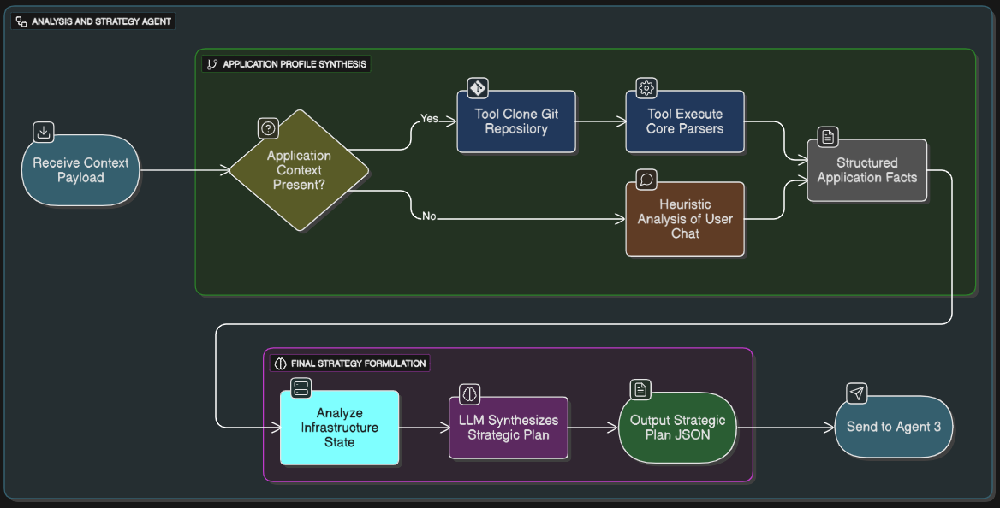

# Agent 2: The Analysis & Strategy Agent

## Overview

This folder contains the complete documentation for **Agent 2**, the strategic planning component of the Multi-Agent System (MAS). Agent 2 acts as a **DevOps architect**, analyzing applications and infrastructure to produce actionable deployment strategies.



## Agent Role

**Input:** Validated JSON payload from Agent 1 (user request + application context + infrastructure state)

**Core Function:** Transform raw data into a strategic plan through adaptive analysis

**Output:** Strategic Plan JSON for Agent 3 (resource recommendations + deployment strategy + configuration checklist)

---

## Key Concepts

### Adaptive Analysis

Agent 2 uses **two analysis paths** based on available data:

| Analysis Path | Trigger | Approach | Confidence |
|--------------|---------|----------|-----------|
| **Deep Analysis** | Repository URL provided | Uses deterministic parsers on Dockerfile, requirements.txt, package.json | High - data-driven |
| **Heuristic Analysis** | No repository | Pattern matching on user keywords, applies safe defaults | Moderate - experience-based |

### Tool-Based Architecture

Agent 2 employs a **pragmatic, restricted toolkit**:

- **Git Interface:** Dynamic repository cloning and file scanning
- **Deterministic Parsers:** Dockerfile, Python requirements.txt, Node.js package.json
- **Graceful Fallback:** Continues analysis even with unsupported tech stacks
- **LLM Synthesis Engine:** Reasons over structured facts to produce strategic plan

### The Required Configurations Checklist

A **critical decoupling mechanism** that separates strategy from implementation:

- **Agent 2 decides WHAT** is needed (e.g., `liveness_probe`)
- **Agent 3 decides HOW** to implement it (e.g., HTTP probe on `/healthz`)

Common directives: `liveness_probe`, `readiness_probe`, `persistent_storage_claim`, `service_exposure`, `high_availability_rules`, `configmap_mount`, `secret_mount`

---

## Documentation Files

### Core Documentation

- **[agent_2.md](agent_2.md)** - Complete consolidated documentation (6 sections, 700+ lines)
  - Section 1: Adaptive Analysis Workflow
  - Section 2: Pragmatic Tool-Based Approach
  - Section 3: Analysis Pipeline
  - Section 4: Output Specification (Strategic Plan)
  - Section 5: Required Configurations Checklist
  - Section 6: Implementation Examples

### Supporting HTML Documentation

- **The Analysis & Strategy Agent.html** - Architecture overview with workflow and output examples
- **A Pragmatic, Tool-Based Approach.html** - Git repository toolkit and parser specifications
- **The Pragmatic Analysis Pipeline.html** - Tool-driven workflow and fallback mechanisms
- **Agent 2 Workflow The Adaptive Analysis Process.html** - DevOps architect reasoning process
- **Agent 2 Output Specification The Strategic Plan.html** - JSON data contract with 4 example scenarios
- **Explanation The Required Configurations Checklist.html** - Separation of concerns and ReAct loop
- **required configuration checklist example.html** - YAML implementation examples for all 7 directives

---

## Agent 2 Workflow

```
┌─────────────────────────────────────────────────────────────┐
│  INPUT: Validated JSON from Agent 1                         │
│  • original_chat                                            │
│  • request_details                                          │
│  • application_context (repository_url?)                   │
│  • infrastructure_state                                     │
└─────────────────────────────────────────────────────────────┘
                            │
                            ▼
┌─────────────────────────────────────────────────────────────┐
│  STEP 1: PATH DETERMINATION                                 │
│  Repository URL present?                                    │
│  • YES → Deep Analysis (Path A)                            │
│  • NO  → Heuristic Analysis (Path B)                       │
└─────────────────────────────────────────────────────────────┘
                            │
            ┌───────────────┴───────────────┐
            ▼                               ▼
┌──────────────────────────┐   ┌──────────────────────────┐
│  PATH A: DEEP ANALYSIS   │   │  PATH B: HEURISTIC       │
│  • Clone repository      │   │  • Scan chat for         │
│  • Scan for files        │   │    keywords (Nginx,      │
│  • Parse Dockerfile      │   │    PostgreSQL, OLLAMA)   │
│  • Parse dependencies    │   │  • Apply built-in        │
│  • Extract facts         │   │    knowledge             │
│  • Graceful fallback     │   │  • Use safe defaults     │
└──────────────────────────┘   └──────────────────────────┘
            │                               │
            └───────────────┬───────────────┘
                            ▼
┌─────────────────────────────────────────────────────────────┐
│  STEP 2: INFRASTRUCTURE FEASIBILITY ANALYSIS                │
│  • Proxmox: Find optimal host, verify storage/templates    │
│  • Kubernetes: Check capacity, quotas, storage classes     │
└─────────────────────────────────────────────────────────────┘
                            │
                            ▼
┌─────────────────────────────────────────────────────────────┐
│  STEP 3: LLM SYNTHESIS ENGINE                               │
│  Inputs:                                                    │
│  • User request (request_details)                          │
│  • Structured facts from parsers                           │
│  • Infrastructure state                                     │
│                                                             │
│  Outputs:                                                   │
│  • platform_target                                         │
│  • resource_recommendations                                │
│  • deployment_strategy                                     │
│  • inferred_dependencies                                   │
│  • required_configurations (checklist)                     │
│  • reasoning_summary (with transparency)                   │
└─────────────────────────────────────────────────────────────┘
                            │
                            ▼
┌─────────────────────────────────────────────────────────────┐
│  OUTPUT: Strategic Plan JSON to Agent 3                     │
└─────────────────────────────────────────────────────────────┘
```

---

## Strategic Plan Output Structure

```json
{
  "strategic_plan": {
    "platform_target": "Kubernetes | Proxmox",
    "resource_recommendations": {
      "cpu_request": "250m",
      "cpu_limit": "1",
      "memory_request": "512Mi",
      "memory_limit": "1Gi",
      "replicas": 2
    },
    "deployment_strategy": {
      "high_availability": true,
      "workload_type": "web-api | web-server | stateful-monolith | general-purpose-vm"
    },
    "inferred_dependencies": ["PostgreSQL", "Redis"],
    "required_configurations": [
      "liveness_probe",
      "readiness_probe",
      "service_exposure",
      "secret_mount"
    ],
    "reasoning_summary": "Explanation of analysis depth (deep vs heuristic) and rationale"
  }
}
```

---

## Integration with Multi-Agent System

### Data Flow

```
Agent 1 → Agent 2 → Agent 3
(Validate)  (Strategize)  (Build)
```

### Agent 2's Position

- **Receives from Agent 1:** Clean, validated, structured data
- **Sends to Agent 3:** High-level strategic plan with actionable directives
- **Never interacts with:** User directly, raw unvalidated input, implementation details

### Separation of Concerns

| Responsibility | Agent 1 | Agent 2 | Agent 3 |
|----------------|---------|---------|---------|
| Input validation | ✅ | ❌ | ❌ |
| Strategy & sizing | ❌ | ✅ | ❌ |
| YAML/HCL generation | ❌ | ❌ | ✅ |
| What to configure | ❌ | ✅ | ❌ |
| How to configure | ❌ | ❌ | ✅ |

---

## Example Use Cases

### Use Case 1: Python Web API on Kubernetes (Deep Analysis)

**Input:** GitHub repository with Dockerfile + requirements.txt (FastAPI, psycopg2)

**Agent 2 Analysis:**
- Parses Dockerfile → detects Python 3.10 base image
- Parses requirements.txt → identifies FastAPI (web API) + psycopg2 (PostgreSQL dependency)
- Classifies workload as `stateless-web-api`
- Checks Kubernetes capacity and quotas

**Strategic Plan Output:**
- Platform: Kubernetes
- Resources: 250m CPU, 512Mi RAM, 2 replicas
- HA: true
- Dependencies: PostgreSQL
- Checklist: `liveness_probe`, `readiness_probe`, `service_exposure`, `secret_mount`
- Reasoning: "Based on deep analysis of FastAPI application..."

### Use Case 2: Nginx on Kubernetes (Heuristic Analysis)

**Input:** User chat "deploy Nginx on Kubernetes" (no repository)

**Agent 2 Analysis:**
- Scans chat for "Nginx" keyword
- Applies built-in knowledge: lightweight web server
- No HA requested → applies conservative defaults
- Checks Kubernetes capacity

**Strategic Plan Output:**
- Platform: Kubernetes
- Resources: 100m CPU, 128Mi RAM, 2 replicas
- HA: false
- Dependencies: []
- Checklist: `liveness_probe`, `readiness_probe`, `service_exposure`
- Reasoning: "Based on heuristic analysis. No repository provided..."

### Use Case 3: Java Monolith on Proxmox (Deep Analysis)

**Input:** GitHub repository with Dockerfile (Java Spring) + unsupported pom.xml

**Agent 2 Analysis:**
- Parses Dockerfile → detects Java base image
- Scans for pom.xml → **unsupported but doesn't fail**
- Uses Dockerfile info + graceful fallback
- Identifies least-stressed Proxmox host

**Strategic Plan Output:**
- Platform: Proxmox
- Resources: 4 CPU, 8Gi RAM, 1 replica
- HA: false
- Dependencies: OracleDB (inferred from JDBC)
- Checklist: [] (Proxmox doesn't use K8s configs)
- Reasoning: "Based on deep analysis. Tech stack partially supported..."

---

## Quick Start

1. **Read [agent_2.md](agent_2.md)** for complete architecture and workflow
2. **Review output examples** in Section 4 to understand Strategic Plan structure
3. **Study the checklist mechanism** in Section 5 to understand Agent 2 ↔ Agent 3 communication
4. **Examine YAML examples** in Section 6 to see how Agent 3 implements directives

---

## Related Documentation

- **[../first agent/agent_1.md](../first%20agent/agent_1.md)** - Agent 1: Chat Validator & Data Collector
- **[../third agent/agent_3.md](../third%20agent/agent_3.md)** - Agent 3: Build & Refinement Agent
- **[../../AI Approaches Documentation/](../../AI%20Approaches%20Documentation/)** - AI methodology comparison
- **[../../README.md](../../README.md)** - Artificial Intelligence folder overview
