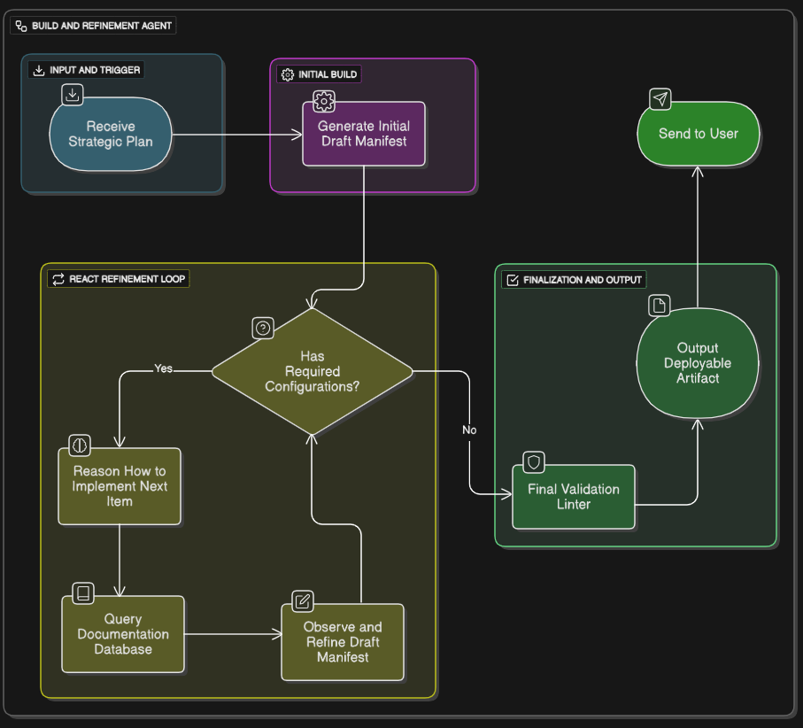
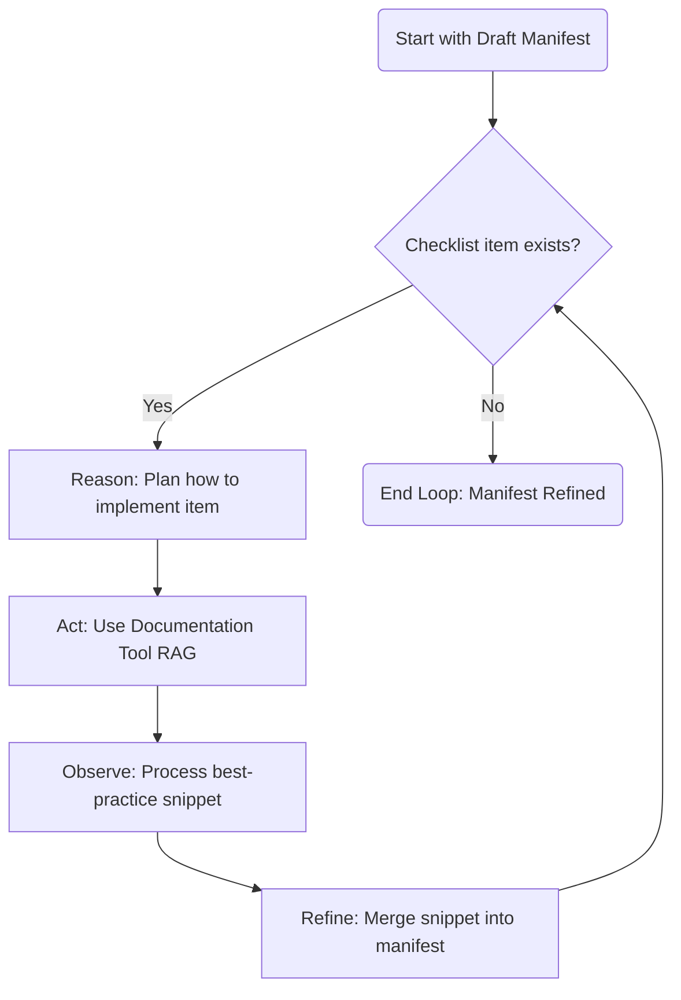

# Agent 3: The Build and Refinement Agent

## Table of Contents
1. [Introduction](#introduction)
2. [Architecture Overview](#architecture-overview)
3. [Core Workflow: Build & Refine](#core-workflow-build--refine)
4. [Agent Toolkit](#agent-toolkit)
5. [The ReAct Refinement Loop (Deep Dive)](#the-react-refinement-loop-deep-dive)
6. [Complete Workflow Description](#complete-workflow-description)
7. [Final Output Specification](#final-output-specification)

---

## Introduction

**Agent 3** serves as the **master craftsperson** in the multi-agent infrastructure provisioning system. Its role is to transform strategic plans into production-ready, deployable artifacts.

### Key Capabilities
- Operates on a robust "Build, then Refine" model
- Generates basic configurations from strategic plans
- Uses ReAct loop to enhance configurations with best practices
- Produces complete, validated deployment artifacts

### Position in Multi-Agent System
```
Agent 1 (Chat Validator) → Agent 2 (Strategic Planner) → Agent 3 (Build & Refine) → Deployable Artifact
```

**Input:** Strategic Plan JSON from Agent 2  
**Output:** Production-ready configuration files (e.g., Kubernetes YAML, Terraform modules)

---

## Architecture Overview



Agent 3's architecture is designed for **maximum reliability and quality**, operating in two distinct phases:

### Phase 1: The Build
- Creates a functional draft manifest
- Uses Initial Manifest Generator tool
- Populates core values from strategic plan

### Phase 2: The Refine
- Iteratively enhances the draft
- Uses ReAct (Reason-Act-Observe) loop
- Incorporates best practices from documentation

---

## Core Workflow: Build & Refine

### Phase 1: Initial Manifest Generation (The Build) 🏗️

The agent takes the "Strategic Plan" from Agent 2 and immediately uses its **Initial Manifest Generator** tool to create a basic, functional manifest.

**This draft is created based on:**
- `platform_target` - Chooses the correct format (e.g., Kubernetes YAML, Terraform HCL)
- `resource_recommendations` - Populates CPU, memory, and replica counts
- `extracted_parameters` - Original user requirements from the context payload

**Output of Phase 1:** A complete but un-enhanced configuration file in memory.

---

### Phase 2: ReAct Refinement Loop (The Refinement) ✨

The agent begins its iterative enhancement process, driven by the `required_configurations` checklist from Agent 2's plan.

**The Loop Process:**

1. **Reason:**  
   The LLM examines the current draft manifest and the next item on its checklist (e.g., `"liveness_probe"`). It thinks, "I need to add a liveness probe to this existing manifest."

2. **Act:**  
   It uses its **Documentation Retriever (RAG)** tool to query: "What is the best-practice YAML for a liveness probe on a web-api workload?"

3. **Observe:**  
   It receives a best-practice YAML snippet from its documentation.

4. **Refine & Repeat:**  
   The agent intelligently merges or adds the new snippet into its draft manifest. It then moves to the next item on the checklist and repeats the loop until all requirements are fulfilled.

**Loop Visualization:**


---

## Agent Toolkit

Agent 3 is equipped with a specific set of tools to execute its two-phase workflow:

### 🏗️ Tool 1: Initial Manifest Generator

**Purpose:** Used in Phase 1  
**Function:** Generates a basic but complete boilerplate manifest (e.g., Kubernetes Deployment)

**Inputs:**
- `platform_target` (e.g., "kubernetes", "proxmox", "terraform-aws")
- `resource_recommendations` (CPU, memory, replicas)
- `extracted_parameters` (app name, image, ports)

**Output:** Complete but un-enhanced configuration file

---

### 📚 Tool 2: Documentation Retriever (RAG)

**Purpose:** Used in Phase 2  
**Function:** Agent's "expert knowledge" tool for best practices

**How It Works:**
- Queries internal knowledge base
- Retrieves best-practice YAML snippets
- Provides configuration patterns for enhancement tasks

**Example Queries:**
- "Best-practice liveness probe for HTTP web service"
- "Pod anti-affinity rules for high availability"
- "Resource limits for production workloads"

**Knowledge Base Sources:**
- Official Kubernetes documentation
- Cloud provider best practices
- DevOps security guidelines
- Production-hardened templates

---

## The ReAct Refinement Loop (Deep Dive)

### Core Concept: A Craftsman's Approach ⚙️

The **ReAct (Reason-Act-Observe)** loop transforms Agent 3 from a simple manifest generator into a master craftsperson. It emulates the thought process of a human expert who measures, cuts, and then checks their work before moving on.

**The Three Phases:**
- **Reason:** The LLM thinks about what it needs to do next
- **Act:** The agent executes a tool to get information or perform an action
- **Observe:** The agent processes the result of the action, updating its understanding

This cycle allows the agent to break down the complex task of "enhancing a manifest" into a series of small, manageable, and verifiable steps.

---

### Concrete Example: Adding a `livenessProbe`

**Scenario:** The agent has a draft `Deployment` YAML and its checklist contains `"liveness_probe"`.

#### Step 1: Initial State
```yaml
# Draft manifest (partial)
containers:
- name: user-auth-service
  image: my-registry/user-auth:v1.2
  ports:
  - containerPort: 3000
  # No liveness probe yet
```

#### Step 2: Reason
**LLM's Internal Thought Process:**
> "The current manifest is missing a liveness probe. The workload type is 'web-api'. I need to find the correct YAML structure for an HTTP-based probe and insert it into the container specification."

#### Step 3: Act
**Tool Execution:**
```
Documentation Retriever Query:
"What is the best-practice YAML snippet for a liveness probe on a Kubernetes web application?"
```

#### Step 4: Observe
**Tool Returns Best-Practice Snippet:**
```yaml
# Snippet returned from Documentation Retriever
livenessProbe:
  httpGet:
    path: /healthz
    port: 8080
  initialDelaySeconds: 15
  periodSeconds: 20
```

#### Step 5: Refine
**LLM Merges Snippet into Draft:**
```yaml
# Enhanced manifest (partial)
containers:
- name: user-auth-service
  image: my-registry/user-auth:v1.2
  ports:
  - containerPort: 3000
  # Liveness probe added during refinement
  livenessProbe:
    httpGet:
      path: /healthz
      port: 3000  # Adjusted to match container port
    initialDelaySeconds: 15
    periodSeconds: 20
```

#### Step 6: Repeat
The agent marks `"liveness_probe"` as complete and moves to the next item on the checklist, restarting the loop.

---

### The Power of This Approach 🏆

**1. Correctness and Best Practices**
- Final manifest is not just syntactically valid, but semantically correct
- Incorporates production-ready patterns from documentation
- Reduces security vulnerabilities and operational issues

**2. Traceability**
- Each loop generates a clear log of "Reason → Act → Observe"
- Easy to debug *why* a specific configuration was added or modified
- Audit trail for compliance and review

**3. Reduced Hallucination**
- LLM grounded in specific tool calls (the "Act" step)
- Far less likely to invent incorrect or deprecated syntax
- Builds upon factual, retrieved information

---

## Complete Workflow Description

### Step 1: Ingest the Strategic Plan

**Input:** JSON object from Agent 2

**Contents:**
- `platform_target` - Deployment target (Kubernetes, Proxmox, etc.)
- `resource_recommendations` - CPU, memory, replicas
- `required_configurations` - Checklist of enhancements needed
- `extracted_parameters` - Original user requirements

**Example Strategic Plan:**
```json
{
  "platform_target": "kubernetes",
  "resource_recommendations": {
    "cpu": "250m",
    "memory": "512Mi",
    "replicas": 2
  },
  "required_configurations": [
    "liveness_probe",
    "readiness_probe",
    "high_availability_rules",
    "service_exposure",
    "secret_mount"
  ],
  "extracted_parameters": {
    "app_name": "user-auth-service",
    "image": "my-registry/user-auth:v1.2",
    "port": 3000
  }
}
```

---

### Step 2: Phase 1 - Initial Manifest Generation (The "Build")

The agent immediately uses its **Initial Manifest Generator** tool.

**Tool Purpose:** Create a complete, but basic, "draft" manifest

**Process:**
1. Generate correct file type based on `platform_target` (e.g., Kubernetes YAML)
2. Set fundamental values: app name, container image, replicas
3. Populate CPU and memory from `resource_recommendations`
4. Create basic container specification

**Output:** Functional but un-enhanced configuration file in working memory

---

### Step 3: Phase 2 - ReAct Refinement Loop (The "Refine")

This is where the agent's intelligence shines. It iterates through the `required_configurations` checklist, using the **ReAct** loop to enhance the draft.

**For Each Checklist Item:**

1. **Reason** about the best way to implement it
2. **Act** by querying the Documentation Retriever (RAG) for best-practice snippets
3. **Observe** the result and intelligently merge the new configuration into the draft

**Loop continues until:** Every item on the checklist has been implemented, transforming the basic draft into a production-ready artifact.

---

### Step 4: Final Output

Once the refinement loop is complete, the agent has a final, complete, and enhanced manifest.

**Output Characteristics:**
- Complete set of configuration files
- All best practices incorporated
- Ready for deployment or GitOps commit
- Traceable back to strategic plan

---

## Final Output Specification

### The Deployable Artifact Package 📄

The final output of Agent 3 is not just a file, but a complete, validated, and production-ready **"Deployable Artifact Package"**. This package contains one or more configuration files ready to be passed directly to an execution engine (like `kubectl`) or committed to a GitOps repository.

---

### Core Characteristics of the Output

**Completeness**
- Includes all necessary components
- For Kubernetes: `Deployment`, `Service`, `ConfigMap`, `Secret`, `PersistentVolumeClaim` as needed
- For Terraform: Complete module with all required resources
- For Proxmox: API parameters or Ansible playbooks

**Best Practices Embodied**
- Not merely functional, but production-ready
- Incorporates security, availability, and observability best practices
- Examples: health probes, resource limits, affinity rules, security contexts

**Platform-Specific**
- Format tailored to `platform_target`
- Kubernetes: YAML manifests
- Terraform: HCL configuration
- Proxmox: API parameters or scripts
- Ansible: Playbook tasks

**Traceability**
- Execution log provides clear trace of construction
- Each section linked back to Agent 2's directives
- Audit trail for compliance and debugging

---

### Example Output Package: Kubernetes YAML

This example shows the complete YAML output Agent 3 would produce for a stateful web application requiring a database password and high availability. Note how it combines multiple Kubernetes resources into a single, cohesive package.

```yaml
# --- BEGIN DEPLOYABLE ARTIFACT ---

# This Secret was generated because "secret_mount" was on the checklist.
apiVersion: v1
kind: Secret
metadata:
  name: user-auth-service-secret
type: Opaque
data:
  DATABASE_PASSWORD: cGFzc3dvcmQxMjM=  # Placeholder password

---
# This Deployment is the core workload.
apiVersion: apps/v1
kind: Deployment
metadata:
  name: user-auth-service
  labels:
    app: user-auth-service
spec:
  replicas: 2
  selector:
    matchLabels:
      app: user-auth-service
  template:
    metadata:
      labels:
        app: user-auth-service
    spec:
      # This affinity block was added because "high_availability_rules" was on the checklist.
      affinity:
        podAntiAffinity:
          requiredDuringSchedulingIgnoredDuringExecution:
          - labelSelector:
              matchExpressions:
              - key: app
                operator: In
                values:
                - user-auth-service
            topologyKey: "kubernetes.io/hostname"
      containers:
      - name: user-auth-service
        image: my-registry/user-auth:v1.2
        ports:
        - containerPort: 3000
        resources:
          requests:
            cpu: "250m"
            memory: "512Mi"
          limits:
            cpu: "1"
            memory: "1Gi"
        # These probes were added because "liveness_probe" and "readiness_probe" were on the checklist.
        livenessProbe:
          httpGet:
            path: /healthz
            port: 3000
          initialDelaySeconds: 15
          periodSeconds: 20
        readinessProbe:
          httpGet:
            path: /ready
            port: 3000
          initialDelaySeconds: 5
          periodSeconds: 10
        # The secrets are mounted as environment variables.
        envFrom:
        - secretRef:
            name: user-auth-service-secret

---
# This Service was generated because "service_exposure" was on the checklist.
apiVersion: v1
kind: Service
metadata:
  name: user-auth-service
spec:
  type: ClusterIP
  selector:
    app: user-auth-service
  ports:
  - port: 80
    targetPort: 3000

# --- END DEPLOYABLE ARTIFACT ---
```

---

### Output Structure Breakdown

**Resource 1: Secret**
- **Purpose:** Store sensitive data (database password)
- **Added during:** Refinement loop (checklist item: `secret_mount`)
- **Best Practice:** Base64 encoded, separate from deployment config

**Resource 2: Deployment**
- **Purpose:** Core application workload
- **Components added during refinement:**
  - Pod anti-affinity rules (checklist: `high_availability_rules`)
  - Liveness probe (checklist: `liveness_probe`)
  - Readiness probe (checklist: `readiness_probe`)
  - Resource requests and limits (from strategic plan)
  - Secret environment variables (checklist: `secret_mount`)

**Resource 3: Service**
- **Purpose:** Expose application within cluster
- **Added during:** Refinement loop (checklist item: `service_exposure`)
- **Configuration:** ClusterIP type for internal communication

---

### Alternative Output Examples

**For Terraform (AWS EC2):**
```hcl
# main.tf - Generated by Agent 3
resource "aws_instance" "app_server" {
  ami           = var.app_ami
  instance_type = "t3.medium"  # From resource_recommendations
  
  # Added during refinement: high_availability_rules
  availability_zone = "us-east-1a"
  
  # Added during refinement: monitoring_enabled
  monitoring = true
  
  # Added during refinement: backup_policy
  tags = {
    Name        = "user-auth-service"
    Backup      = "daily"
    Environment = "production"
  }
}

resource "aws_security_group" "app_sg" {
  # Added during refinement: security_rules
  ingress {
    from_port   = 3000
    to_port     = 3000
    protocol    = "tcp"
    cidr_blocks = ["10.0.0.0/8"]
  }
}
```

**For Proxmox (API Parameters):**
```json
{
  "vmid": 100,
  "name": "user-auth-service",
  "cores": 2,
  "memory": 2048,
  "net0": "virtio,bridge=vmbr0",
  "scsi0": "local-lvm:32",
  "ostype": "l26",
  "boot": "order=scsi0",
  "agent": 1
}
```

---

## Summary

Agent 3 serves as the final, critical step in the multi-agent infrastructure provisioning pipeline:

**Key Strengths:**
- ✅ Two-phase approach ensures completeness and quality
- ✅ ReAct loop incorporates production best practices
- ✅ Platform-agnostic design (Kubernetes, Terraform, Proxmox, etc.)
- ✅ Traceability and auditability
- ✅ Reduced hallucination through grounded tool use

**Integration in SRP System:**
- Receives strategic plans from Agent 2
- Produces deployable artifacts ready for execution
- Supports GitOps workflows and CI/CD pipelines
- Enables automated, intelligent infrastructure provisioning

**Next Steps:**
- Output can be committed to Git for version control
- Deployed via CI/CD pipelines (GitOps)
- Executed by orchestration engines (kubectl, terraform apply)
- Monitored and refined based on runtime metrics
