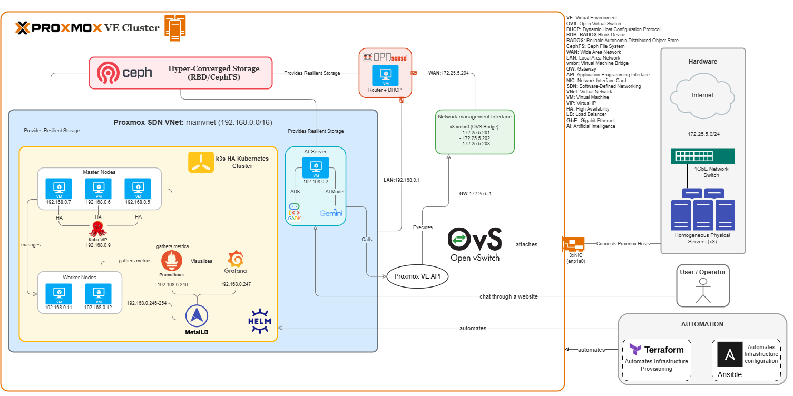

# Implementation Description

## Overview

This document outlines the implementation steps for building a production-ready, high-availability infrastructure using Proxmox VE for virtualization and K3s for container orchestration. The infrastructure includes distributed storage with Ceph, automated provisioning with Terraform and Ansible, and comprehensive monitoring.



## Prerequisites

- **Hardware**: Minimum 3 bare-metal servers (for HA cluster)
- **Network**: Network infrastructure with VLAN support
- **Storage**: Multiple disks per server (for Ceph storage)
- **Software**: 
  - Proxmox VE ISO image
  - OPNsense ISO image
  - Cloud-init enabled OS image (Ubuntu/Debian)
- **Access**: SSH access and root privileges on all servers
- **Tools**: Terraform and Ansible installed on management workstation

## Technology Stack

- **Virtualization**: Proxmox VE with HA and live migration
- **Storage**: Ceph cluster storage and CephFS
- **Orchestration**: Kubernetes (K3s) with HA master nodes
- **Configuration Management**: Ansible
- **Infrastructure as Code**: Terraform
- **Networking**: Open vSwitch (OVS), Software-Defined Networking (SDN)
- **Firewall/Router**: OPNsense (DNS, DHCP, routing)
- **Load Balancing**: MetalLB
- **Package Management**: Helm
- **Monitoring**: Prometheus and Grafana
- **Management UI**: Rancher

## Network Configuration

```bash
sudo ip route add 192.168.0.0/16 via 172.25.5.204
```

## Implementation Steps

### Step 1: Install Proxmox VE
Install Proxmox VE on the bare-metal servers.

### Step 2: Partition the Disk
Partition each disk into three parts:
- **Local storage**: For VM images and local data
- **Ceph cluster storage**: For distributed block storage
- **CephFS**: For distributed file system

### Step 3: Install Ceph and OVS
Install Ceph for distributed storage and Open vSwitch for advanced networking capabilities.

### Step 4: Create the Cluster
Create a Proxmox cluster to enable HA and resource pooling.

### Step 5: Set Up Ceph Storage
Configure Ceph storage pools and integrate them with Proxmox.

### Step 6: Create VM Template on pmox01
Create a base VM template on the first Proxmox node for rapid VM provisioning.

### Step 7: Set Up the Network
Configure the base network infrastructure across all nodes.

### Step 8: SDN Configuration
Configure Software-Defined Networking for flexible network management.

### Step 9: OPNsense Configuration
Set up OPNsense as the firewall and router with:
- DNS server configuration
- DHCP server configuration
- Router configuration

### Step 10: Set Up High Availability
Configure HA for automatic VM failover between cluster nodes.

### Step 11: Set Up API Key for Terraform
Generate and configure API keys in Proxmox for Terraform automation.

### Step 12: Set Up Backup
Configure automated backup solutions for VMs and critical data.

### Step 13: Provision Kubernetes Cluster Using Terraform
Use Terraform to provision the VMs that will host the Kubernetes cluster.

### Step 14: Set Up Kubernetes Cluster Using Ansible
Use Ansible playbooks to configure the provisioned VMs as Kubernetes nodes.

### Step 15: Create K3s Cluster with HA
Deploy a K3s cluster with high availability:
- 3 control plane nodes
- 2 worker nodes
- Using the open-source Ansible script from [techno-tim/k3s-ansible](../../../k3s_cluster_creation_with_ansible_script/) that I modified to fit my requirements.

### Step 16: Install Helm
Install Helm on control-node-3 to manage Kubernetes applications and gain cluster access.

### Step 17: Install Rancher
Deploy Rancher on the K3s cluster using Helm for centralized Kubernetes management.

### Step 18: Install Grafana and Prometheus
Deploy Grafana and Prometheus on the K3s cluster using Helm for monitoring and observability.

### Step 19: Set Up the AI Server Using Terraform
Use Terraform to provision and configure the AI server within the infrastructure.

### Step 20: Install ADK Agent Development Kit
Install the Google ADK (Agent Development Kit) on the AI server to enable AI agent development capabilities.

### Step 21: Deploy the AI Agent
Deploy the AI agent on the AI server to start processing and handling AI-related tasks.

### Step 22: Final Testing and Validation
Conduct thorough testing to ensure all components are functioning as expected and validate the overall infrastructure setup.

## Notes

This implementation provides a production-ready, highly available infrastructure with:
- Automated provisioning and configuration
- Distributed storage with Ceph
- Container orchestration with K3s
- Comprehensive monitoring and management tools
- Network isolation and security with OPNsense
