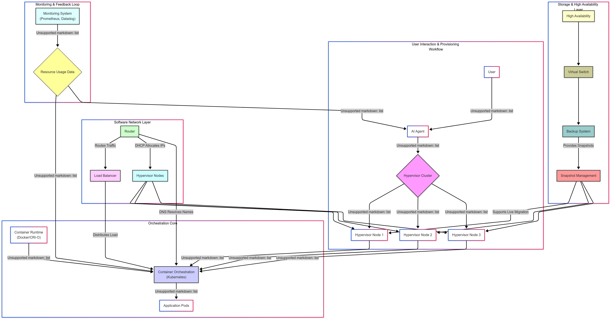

# Global Architecture – Smart Resource Provisioning (SRP)

## Overview

This folder contains **draft conceptual architecture documentation** for the Smart Resource Provisioning and Prediction system, developed as part of the master's thesis:

> **"Design and Implementation of an Automated and Scalable Deployment and Provisioning Solution for IT Infrastructure and Applications"**  
> *Field: Networking and Distributed Systems*

⚠️ **Note:** These documents represent the **first version** of the architecture and are subject to revision as implementation progresses.

---

## Architecture Visualization

**Figure 1:** Complete SRP first-version architecture illustrating all eight layers—from bare-metal infrastructure to agentic AI—including monitoring feedback loops, storage with high availability, SDN layer, container orchestration, and user interaction workflows.

---

## Working with the Diagrams

### Mermaid Syntax
All architectural diagrams in the markdown files use **Mermaid** syntax for easy version control and editing. They can be rendered on:

- **[Mermaid Live Editor](https://mermaid.live/)** – Interactive editor with export options
- **GitHub** – Native Mermaid rendering in markdown
- **VS Code** – Install Mermaid extension for preview
- **Documentation platforms** – Confluence, GitBook, Docusaurus, etc.

### How to Edit/View Diagrams
1. **Copy** the Mermaid code block from any `.md` file in this folder
2. **Paste** into [mermaid.live](https://mermaid.live/) for interactive editing
3. **Modify** the diagram as needed
4. **Export** as SVG/PNG for presentations or documentation

---

## Files in this Folder
Documentation Files

| File | Description |
|------|-------------|
| **SRP_conceptual_architecture.md** | 📋 **Primary reference** – Complete 8-layer model with component descriptions, interaction flows, and comprehensive diagrams |
| **global_arch.md** | 🎯 **Use-case focused** – AI-driven Kubernetes resource provisioning scenario with deployment examples
---

## Architecture Layers

The SRP system comprises **eight interconnected layers**:

1. **Bare-Metal Cluster Hypervisor** – Physical compute foundation
2. **Shared Storage Layer** – Centralized, resilient storage
3. **Physical Network Layer** – Network fabric and connectivity
4. **SDN & Virtual Network Services** – Programmable networking
5. **Orchestration Layer** – Container orchestration (Kubernetes)
6. **Container Runtime Layer** – Container execution environment
7. **Management, Monitoring & Automation** – Observability and control
8. **Agentic AI Layer** – Intelligent provisioning and prediction

---

## Related Project Resources

| Folder | Contents |
|--------|----------|
| **`/diagrams`** | DrawIO source files (`.drawio`) for detailed component diagrams |
| **`/ai_agent`** | AI agent implementation code and subagent modules |
| **`/terraform_script`** | Infrastructure as Code (Terraform) for VM and network provisioning |
| **`/other_ansible_script`** | Ansible playbooks for automated deployment and configuration |
| **`/k3s_cluster_creation_with_ansible_script`** | K3s cluster deployment automation |

---

**Project Repository:** [PFE2025-RSD](../..)  
**Architecture Status:** Draft v1.0 – Subject to refinement during implementation phase

