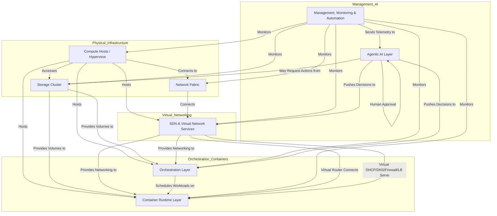

# Smart Resource Provisioning and Prediction (SRP) – Conceptual Architecture

## Layer Mapping to Thesis/Report

This conceptual architecture follows the eight-layer model described in the thesis “Design and Implementation of an Automated and Scalable Deployment and Provisioning Solution for IT Infrastructure and Applications.” The layers correspond as follows:

| Conceptual Layer                       | Thesis/Report Terminology           |
| -------------------------------------- | ----------------------------------- |
| 1. Bare-Metal Cluster Hypervisor       | Bare-Metal Cluster Hypervisor       |
| 2. Shared Storage Layer                | Shared Storage Layer                |
| 3. Physical Network Layer              | Physical Network Layer              |
| 4. SDN & Virtual Network Services      | SDN & Virtual Network Services      |
| 5. Orchestration Layer                 | Orchestration Layer                 |
| 6. Container Runtime Layer             | Container Runtime Layer             |
| 7. Management, Monitoring & Automation | Management, Monitoring & Automation |
| 8. Agentic AI Layer                    | Agentic AI Layer                    |

---

## Overview

This architecture describes an eight-layered, modular system for automated, intelligent resource provisioning and prediction in a modern data center. Each layer abstracts a set of core functions, with clear data and control flows between them. All components are described in generic terms, focusing on conceptual roles and interactions.

---

## Layered Architecture

### 1. Bare-Metal Cluster Hypervisor

- **Components:** Physical Compute Hosts (clustered), Hypervisor Control Plane
- **Role:** Provides foundational compute resources, high availability, and live migration.
- **Interactions:**
  - Compute hosts connect to the physical network fabric.
  - Heartbeat and state replication traffic over dedicated network segments.

### 2. Shared Storage Layer

- **Components:** Storage Cluster (Primary Volume, Backup/Snapshot Volume)
- **Role:** Centralized, resilient storage for virtual machines and containers.
- **Interactions:**
  - Compute hosts access storage cluster via storage network protocols.
  - Orchestration and backup operations trigger snapshots and data movement.

### 3. Physical Network Layer

- **Components:** Network Fabric (Switches, Routers), Network Interfaces (Management, Data)
- **Role:** Provides physical connectivity, segmentation, and external access.
- **Interactions:**
  - Compute hosts connect to network fabric via multiple NICs.
  - VLANs separate management, storage, and data traffic.

### 4. SDN & Virtual Network Services

- **Components:** SDN Controller, Virtual Router, Virtual DHCP, Virtual DNS, Virtual Firewall, Virtual Load Balancer, Internal VMs
- **Role:** Programmable, virtualized network services for flexible, secure connectivity.
- **High Availability:** Critical network service VMs (DNS, DHCP, Router, LB, Firewall) should be deployed in a highly available configuration (e.g., clustering or orchestrator-managed HA) to avoid single points of failure.
- **Interactions:**
  - SDN controller manages flows between virtual network services and internal VMs.
  - Virtual router connects private subnets to LAN and Internet, manages NAT.
  - Virtual network services support VM networking across hypervisor clusters.

### 5. Orchestration Layer

- **Components:** Orchestration Control Plane, Automation Workloads, Scheduling Engine
- **Role:** Automates deployment, scaling, and management of workloads and infrastructure tasks.
- **Interactions:**
  - Orchestration schedules workloads on compute hosts, leveraging cluster health and storage state.
  - Communicates with SDN for network configuration and with storage for persistent volumes.

### 6. Container Runtime Layer

- **Components:** Container Runtime Engines, Image Registry
- **Role:** Executes containerized workloads as scheduled by the orchestration layer.
- **Interactions:**
  - Container runtimes run on compute hosts, managed by orchestration.
  - Pulls images from internal registry.
  - Hypervisor provides isolation and resource allocation for containers.

### 7. Management, Monitoring & Automation Layer

- **Components:** Monitoring System, Logging System, Automation Engine, Management Overlay Network
- **Role:** Provides observability, logging, and automated management across all layers.
- **Interactions:**
  - Scrapes metrics from compute hosts, storage, network, SDN, orchestration, and containers.
  - Triggers alerts and automation workflows.
  - Feeds telemetry to the Agentic AI layer.

### 8. Agentic AI Layer

- **Components:** Monitor Agent, Actuator Agent, Messaging Bus, Human-in-the-Loop Interface
- **Role:** Intelligent monitoring, anomaly detection, and automated remediation.
- **Feedback Loop:** The Agentic AI layer continuously refines its prediction and remediation models by analyzing the outcomes of its actions and actual resource usage, enabling ongoing improvement.
- **Interactions:**
  - Ingests metrics and logs from the monitoring system.
  - Pushes provisioning and remediation decisions to the orchestration and SDN control planes.
  - Supports human approvals and feedback.
  - Example: If the Actuator Agent plans a scaling action, it can require human approval for execution in critical scenarios (e.g., scaling down production workloads during peak hours), ensuring safety and oversight.

---

## Interactions & Data Flows

**Diagram Legend:**

- **Solid arrows (-->):** Data/control flow or direct interaction
- **Dashed arrows (-->) in SDN section:** Local SDN service interactions
- **Subgraphs:** Represent logical groupings of layers

### Arrow Key/Legend

- **Solid Arrows (-->):** Data/control flow or direct interaction.
- **Dashed Arrows (-->) in SDN section:** Local SDN service interactions.
- **Subgraphs:** Represent logical groupings of layers.

---

## Key Interaction Descriptions

- **Compute Hosts ↔ Network Fabric:** Physical NICs connect each host to the network, supporting both management and data traffic.
- **Compute Hosts ↔ Storage Cluster:** All hosts mount shared storage for VM disks and container volumes, enabling live migration and HA.
- **Layer-to-Layer Communication:** Each layer exposes APIs or interfaces to adjacent layers for control and data exchange.
- **SDN Local Communication:** Virtual router, DHCP, DNS, firewall, and load balancer VMs interact to provide seamless, secure networking for all internal VMs and containers, regardless of their physical host.
- **Hypervisor ↔ Container Runtime ↔ Orchestration ↔ Monitoring:** The hypervisor provides isolation for containers; the container runtime executes workloads as scheduled by orchestration; monitoring collects metrics from all layers.
- **Agentic AI ↔ Monitoring & Control:** The Monitor Agent ingests telemetry from the monitoring system, reasons over it, and the Actuator Agent pushes provisioning or remediation actions into the orchestration and SDN control planes, with optional human approval.

---

## Summary Table: Layer Roles & Interactions

| Layer                    | Abstract Components              | Upstream/Downstream Interactions         |
| ------------------------ | -------------------------------- | ---------------------------------------- |
| 1. Bare-Metal Cluster    | Compute Hosts, Hypervisor        | Network, Storage, SDN, Orchestration     |
| 2. Shared Storage        | Storage Cluster                  | Compute Hosts, Orchestration, Containers |
| 3. Physical Network      | Network Fabric                   | Compute Hosts, SDN                       |
| 4. SDN & Virtual Network | SDN Controller, Virtual Services | VMs, Containers, Orchestration           |
| 5. Orchestration         | Orchestration Control Plane      | Containers, SDN, Storage, AI             |
| 6. Container Runtime     | Container Engines, Registry      | Orchestration, SDN, Monitoring           |
| 7. Management/Monitoring | Monitoring, Logging, Automation  | All Layers, AI                           |
| 8. Agentic AI            | Monitor Agent, Actuator Agent    | Monitoring, Orchestration, SDN, Human    |
