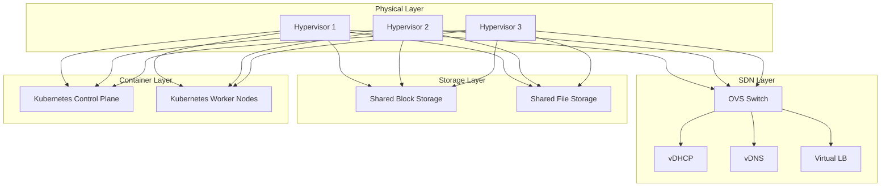
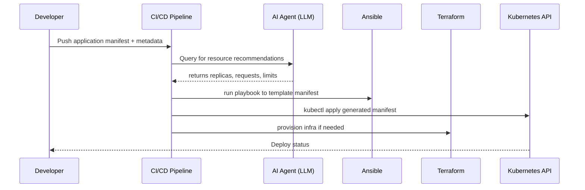

# Smart Resource Provisioning and Prediction Architecture

This document describes the global architecture for a Smart Resource Provisioning system that leverages an AI agent (LLM) to predict and configure resource allocations for new Kubernetes applications in a bare‑metal hypervisor cluster environment.

---

## 1. Overview

The Smart Resource Provisioning solution enables automated, AI‑driven recommendations for initial Kubernetes resource sizing (`replicas`, `resources.requests`, `resources.limits`) during application deployment. It integrates:  

- **Bare‑metal hypervisor cluster** (3 nodes)  
- **Software‑Defined Networking (SDN)** using Open vSwitch (OVS), virtual DHCP, DNS, and load balancer  
- **Software‑Defined Storage** (shared storage for VMs and containers)  
- **Container orchestration** (Kubernetes on top of hypervisors)  
- **AI Agent** powered by LLM, orchestrated via Ansible, Terraform, and platform APIs

**Goal:** Prevent under‑ or over‑provisioning by providing sensible initial resource allocations for new microservices (e.g., Python/FastAPI).

---

## 2. Physical and Virtual Infrastructure



- **Hypervisors (Bare‑Metal):** Three physical servers hosting virtual machines.  
- **SDN (OVS):** Central switch providing L2 connectivity; virtualized DHCP, DNS, and Load Balancer services run as VMs/containers.  
- **Software‑Defined Storage:** Provides shared block (iSCSI/Ceph) and file (NFS/CephFS) storage for both VMs and containers.  
- **Kubernetes Cluster:** Runs on VMs provisioned on hypervisors; control plane and worker nodes co‑located.

---

## 3. AI Agent Integration

The AI Agent orchestrates provisioning by leveraging:  

- **LLM Model**: Predicts resource sizing based on application metadata and historical metrics.  
- **Ansible**: Executes playbooks to configure infrastructure and deploy manifests.  
- **Terraform**: Manages infrastructure provisioning (networks, storage, VMs).  
- **Platform APIs**: Kubernetes API, Monitoring API (Prometheus/Grafana), Cloud/Infra APIs.



1. **Developer** submits a new microservice to CI/CD.  
2. **CI/CD** calls the AI Agent with service metadata (language, endpoints, expected traffic).  
3. **AI Agent** returns initial `replicas`, CPU/memory `requests` & `limits`.  
4. **Ansible** templates the Kubernetes manifest.  
5. **Terraform** ensures underlying infrastructure (storage, networking).  
6. **Kubernetes API** deploys the service; feedback loop collects runtime metrics.

---

## 4. Deployment Scenario

### 4.1 Use Case: Python/FastAPI Microservice

| Attribute                | Example Value                          |
|--------------------------|----------------------------------------|
| Language                 | Python 3.10                            |
| Framework                | FastAPI                                |
| Endpoints                | `/health`, `/api/v1/items`             |
| Expected QPS             | 50–100 req/sec                         |
| Historical Similarities  | Similar image‑processing services      |

**AI Agent Recommendation** (sample):

```yaml
apiVersion: apps/v1
kind: Deployment
metadata:
  name: fastapi-backend
spec:
  replicas: 3  # recommended by LLM
  template:
    spec:
      containers:
      - name: app
        image: myregistry/fastapi:latest
        resources:
          requests:
            cpu: "250m"
            memory: "512Mi"
          limits:
            cpu: "500m"
            memory: "1Gi"
```  

### 4.2 Verification Goal

- **Stability**: No OOMKills or CPU saturation on initial launch.  
- **Efficiency**: ≤10% resource slack compared to actual usage at 24h.  
- **Iteration**: Continuous metrics feed back into LLM fine‑tuning.

---

## 5. Benefits

- **Reduced Manual Guesswork**: Developers save time.  
- **Optimized Infrastructure**: Lower costs, higher utilization.  
- **Data‑Driven Decisions**: Leverage historical and real‑time metrics.

---

## 6. Next Steps

1. Integrate real‑time monitoring feedback loop to retrain LLM.  
2. Expand support for stateful workloads (databases, caches).  
3. Implement multi‑tenant isolation policies via Namespace quotas.


