# 🤖 AI-Driven Infrastructure Automation for Proxmox

> **What if infrastructure could provision itself intelligently?**

[](LICENSE)
[](README.md)
[](README.md)
[](README.md)

---

## 💡 The Big Idea

**Stop manually sizing VMs. Let AI do it for you.**

This Master's thesis project demonstrates how **multi-agent AI systems** can replace manual infrastructure provisioning with intelligent, automated decision-making. Simply tell our system what you need, and watch it analyze your cluster, predict optimal resources, and deploy production-ready VMs—all automatically.

```
"I need a web server" → 30 seconds later → ✅ Optimally-configured VM running
```

### 🎓 Academic Context
**Master's Thesis (PFE 2025)** | Computer Science - Networking & Distributed Systems  
📄 [Read the full thesis (English)](Pfe_30_RSD_EN.pdf) | [Lire en français](Pfe_30_RSD_FR.pdf)

---

## 🎯 What Makes This Different?

### Traditional Provisioning ❌
- Manual resource guessing based on generic guidelines
- Switching between Proxmox UI, Terraform, monitoring tools
- Trial-and-error: deploy → test → resize → repeat
- No learning from past deployments
- **Result:** Slow, inefficient, error-prone

### Our AI-Powered Approach ✅
- **Intelligent analysis** of real-time cluster state
- **Workload-aware predictions** (web, database, app servers)
- **Automatic Terraform generation** with optimal configs
- **Learns from cluster patterns** to select best nodes
- **Result:** Fast, optimal, automated

---

## 🚀 How It Works

**Chat with AI → Get optimized infrastructure**

```mermaid
graph LR
    A[💬 User Request] --> B[🤖 AI Agents]
    B --> C[🔍 Analyze Cluster]
    C --> D[🧠 Predict Resources]
    D --> E[📄 Generate Terraform]
    E --> F[🚀 Deploy VM]
    F --> G[✅ Running & Optimized]
```



### Behind the Scenes: Multi-Agent Orchestra

Our system uses **5 specialized AI agents** working together:

1. **💬 Chat Validator** - Understands what you need ("web server" → specific requirements)
2. **📊 Data Collector** - Scans your Proxmox cluster in real-time (nodes, storage, network)
3. **🧠 Manifest Generator** - Uses Gemini 2.5 Pro to predict optimal resources
4. **🔍 Reviewer Agent** - Ensures configuration quality
5. **✨ Refiner Agent** - Perfects the Terraform output (up to 10 iterations)

**The Magic:** Gemini 2.5 Pro analyzes workload patterns and knows that a PostgreSQL database needs more RAM than a static web server—automatically.

### Live Architecture


**What's Running:**
- 🖥️ **4-node Proxmox VE cluster** with high availability
- 💾 **Ceph hyper-converged storage** for data resilience
- ☸️ **K3s Kubernetes** (3 masters + 2 workers)
- 🤖 **AI server** running Google ADK + Gemini
- 📊 **Full monitoring** (Prometheus + Grafana)
- 🌐 **SDN networking** with Open vSwitch

[Explore architecture details →](diagrams/)

---

## 🏆 What We Achieved

### Research Contributions

This thesis breaks new ground in **AI-driven infrastructure automation**:

| Contribution | Impact |
|-------------|--------|
| 🏗️ **Multi-Agent Architecture** | First implementation of coordinated AI agents for infrastructure provisioning |
| 🧠 **Intelligent Workload Prediction** | LLMs can accurately predict optimal resources based on workload types |
| 🔗 **AI + IaC Integration** | Proven patterns for connecting AI decision-making with Terraform/Ansible |
| 🔄 **Iterative Refinement** | Self-improving system that perfects configurations through 10 iterations |
| ⚡ **Production Deployment** | Actually works on real 4-node Proxmox cluster, not just theory |
| 📚 **Complete Journey** | Documented all iterations—successes AND failures |

**Keywords:** Multi-Agent Systems, Infrastructure as Code, LLMs, Proxmox, Kubernetes, Intelligent Provisioning

---

## 🛠️ Technology Stack

### The AI Brain 🧠
- **Google Agent Development Kit (ADK)** - Multi-agent orchestration framework
- **Gemini 2.0 Flash** - Lightning-fast inference for 4/5 agents
- **Gemini 2.5 Pro** - Heavy-duty reasoning for resource predictions

### The Infrastructure Foundation 💻
- **Proxmox VE** - Enterprise-grade bare-metal virtualization
- **Ceph** - Distributed storage across nodes (no single point of failure)
- **K3s** - Lightweight Kubernetes (perfect for edge deployments)
- **Open vSwitch** - Software-defined networking with VLAN isolation

### The Automation Layer 🔧
- **Terraform** - Declarative infrastructure as code
- **Ansible** - Configuration management and orchestration
- **Helm** - Kubernetes package manager

### The Observability Stack 📊
- **Prometheus** - Metrics collection and alerting
- **Grafana** - Beautiful dashboards and visualization
- **Rancher** - Kubernetes cluster management UI

### Development 💾
- **Python 3.8+** - AI agent implementation
- **Bash** - Automation glue
- **YAML/HCL** - Configuration languages

---

## 📂 What's Inside?

This repository is **more than just code**—it's a complete research journey:

### 🤖 AI Agents (`ai_agent/`)
- **First Trial** - Where it all began (simple data collector)
- **Second Iteration** - Added intelligence
- **Final System** - Production-ready multi-agent orchestration

### 🔧 Automation (`other_ansible_script/` + `k3s_cluster_creation/`)
- Proxmox cluster setup and management
- Network configuration (SDN, OVS, VLANs)
- K3s HA cluster deployment
- VM template creation

### 🏗️ Infrastructure as Code (`terraform_script/`)
- Example Terraform configurations
- Cloud-init templates
- HA and networking setup

### 📚 Documentation (`Documents/`)
- **ThesisSheets/** - Complete academic documentation
  - All 3 agent iterations documented
  - Architecture designs and diagrams
  - Implementation strategies
  - Lessons learned
- **helpfull/** - Practical Proxmox guides
- **helpfull-research-paper/** - Academic papers that informed this work

### 📐 Diagrams (`diagrams/`)
- System architecture visuals
- Multi-agent workflow diagrams
- Network topology

**🎓 Bonus:** Full thesis in [English](Pfe_30_RSD_EN.pdf) and [French](Pfe_30_RSD_FR.pdf)

### 📂 Repository Structure

```
PFE2025-RSD/
├── ai_agent/                                    # 🤖 AI Agent Implementations
│   ├── agent_withADK/
│   │   └── first_trial_agent/                   # Initial single-agent prototype
│   └── Proxmox-Smart-Provisioning-Agent-withADK/ # Multi-agent system (FINAL)
│
├── other_ansible_script/                        # 🔧 Infrastructure Automation
│   ├── proxmox/                                 # Proxmox cluster management
│   ├── k8s/                                     # Kubernetes node setup
│   └── roles/                                   # Ansible roles for automation
│
├── k3s_cluster_creation_with_ansible_script/    # ☸️ K3s Deployment
│   └── (Modified techno-tim/k3s-ansible playbook)
│
├── terraform_script/                            # 🏗️ Terraform VM Provisioning
│   └── create_new_vm_using_terraform.tf
│
├── diagrams/                                    # 📐 Architecture Diagrams
│   ├── Main_diagrams.drawio                     # Master thesis diagrams
│   └── (templates for reuse)
│
├── Documents/                                   # 📚 Complete Documentation Archive
│   ├── ThesisSheets/                            # Academic research documentation
│   ├── helpfull/                                # Practical Proxmox guides
│   └── helpfull-research-paper/                 # Academic reference papers
│
└── images/                                      # 🖼️ Reference Images & Screenshots
```

---

## ⚡ Quick Start

Want to try it yourself? Here's how:

###  1. Grab the Code

```bash
git clone https://github.com/Benmeddour/PFE2025-RSD.git
cd PFE2025-RSD
```

### 2. Set Up the AI Brain (Optional)

```bash
cd ai_agent/Proxmox-Smart-Provisioning-Agent-withADK
echo "GOOGLE_API_KEY=your_gemini_api_key" > .env
pip install google-adk google-genai requests
```

### 3. Deploy the Infrastructure

**Full production setup** (Proxmox cluster + Ceph + K3s + Monitoring):

📘 **[22-Step Implementation Guide →](Documents/ThesisSheets/Implementation/implementation-description.md)**

Includes:
- Proxmox VE cluster setup
- Ceph distributed storage
- Software-defined networking
- K3s HA Kubernetes cluster
- Prometheus + Grafana monitoring
- AI agent deployment

**Quick test** (just the AI agent):

```bash
# Configure Ansible inventory
cd other_ansible_script
nano inventory.yaml  # Add your Proxmox IPs

# Test Terraform provisioning
cd terraform_script
terraform init && terraform apply
```

### Prerequisites

**For AI Agents:**
- Google Cloud account (Gemini API access)
- Python 3.8+
- Proxmox VE cluster

**For Full Deployment:**
- 4+ bare-metal servers (Proxmox nodes)
- Ansible control node
- Terraform CLI
- Network with VLAN support

---

## 📚 Deep Dive

Want to understand how everything works?

###  Component Documentation

| Component | What It Does | Learn More |
|-----------|--------------|------------|
| 🤖 **AI Agent System** | Multi-agent orchestration | [Deep dive →](ai_agent/Readme.md) |
| 🔧 **First Trial** | Initial prototype | [See evolution →](ai_agent/agent_withADK/first_trial_agent/Readme.md) |
| 🚀 **Final System** | Production agent | [Full docs →](ai_agent/Proxmox-Smart-Provisioning-Agent-withADK/README.md) |
| ⚙️ **Ansible Automation** | Infrastructure playbooks | [Explore →](other_ansible_script/README.md) |
| ☸️ **K3s Deployment** | Kubernetes cluster | [Deploy guide →](k3s_cluster_creation_with_ansible_script/README.md) |
| 🏗️ **Terraform Configs** | VM provisioning | [Examples →](terraform_script/README.md) |
| 📐 **Architecture** | System diagrams | [Visualize →](diagrams/README.md) |

### 📖 Project Wiki

**[📚 Comprehensive Wiki →](https://github.com/Benmeddour/ai-driven-infrastructure-resource-provisioning/wiki)**

In-depth guides, tutorials, and documentation including:
- Detailed setup walkthroughs
- Architecture deep-dives
- Troubleshooting guides
- Best practices and tips

### Research Materials

- **[ThesisSheets/](Documents/ThesisSheets/)** - The complete research story
  - Evolution from first agent to final system
  - What worked, what didn't, and why
  - Architecture decisions and tradeoffs
  
- **[Practical Guides](Documents/helpfull/)** - Hands-on Proxmox tutorials
  - Installation and setup
  - Networking (SDN, OVS, VLANs)
  - Storage and VM templates
  
- **[Research Papers](Documents/helpfull-research-paper/)** - Academic foundations
  - Auto-scaling frameworks
  - Datacenter automation
  - Cloud provisioning research

### Related Work

- **[terraform-proxmox-automatic-vm-provisioning](https://github.com/Benmeddour/terraform-proxmox-automatic-vm-provisioning)** - Extended Terraform configs
- **[techno-tim/k3s-ansible](https://github.com/techno-tim/k3s-ansible)** - Original K3s playbook (we modified it)

---

## ⚠️ Important Notices

### This is Research Code

**Built for learning and demonstration, not production.**

Before using in production:
- 🔐 Remove hardcoded credentials (use vaults/secret managers)
- ✅ Enable SSL/TLS verification
- 🔒 Implement proper RBAC
- 📝 Enable audit logging
- 🧪 Test thoroughly in staging environment
- 👁️ Review ALL AI-generated configurations

*Use at your own risk. Always test in non-production first.*

### The Complete Journey

What makes this special? We kept **everything**:

- ✅ **Working code** - The final multi-agent system
- ❌ **Failed attempts** - First and second agent iterations
- 🔄 **Iterations** - Three complete versions showing evolution
- 📚 **Learning** - Documentation of why decisions were made
- 🧪 **Tests** - Validation scenarios and results
- 📖 **Context** - From initial research to final deployment

**This isn't just a thesis deliverable—it's a research story.**

---

## 🤝 Get Involved

This is an academic project, but feedback is welcome!

- 💬 **Questions?** Open an issue
- 🐛 **Found a bug?** Let us know
- 💡 **Improvements?** Share your ideas
- 🎓 **Using for research?** We'd love to hear about it

Not looking for code contributions, but **feedback on the approach and architecture is gold.**

---

## 📜 Legal Stuff

**License:** Apache 2.0 - Use it, learn from it, build on it  
**Attribution:** Based on open-source work (K3s Ansible playbook: Apache 2.0)

**Full thesis documents:**
- 📄 [Complete thesis (English)](Pfe_30_RSD_EN.pdf)
- 📄 [Thèse complète (Français)](Pfe_30_RSD_FR.pdf)

---
